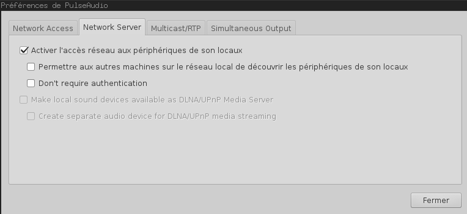
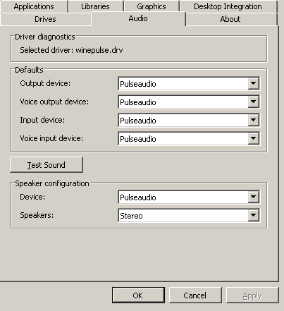
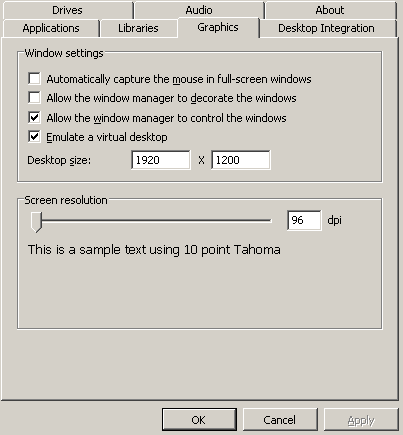

#Windows games on Linux! Steam games!

Play Steam and Windows games on Linux using Wine to do so and confining the mess inside a Docker container.
Bind X11's socket for the windows to appear and use ear the sound from PulseAudio.

##Prerequisites

###Docker

Be sure to have Docker installed. Detailed explanations are given on the [Docker official site](https://docs.docker.com/installation/).
For Ubuntu 14.04 you can install the maintained packaged.
```
sudo apt-get update
sudo apt-get install -y docker.io
```

###PulseAudio

For the sound to work, you need the PulseAudio server.
You can check if it's installed and configured by launching a sample sound and looking for a pulseaudio process.
```
aplay /usr/share/sounds/alsa/Front_Center.wav && ps -A | grep pulseaudio
```

###A supported GPU
Currently, Nvidia cards should work out of the box whereas AMD and Intel Integrated chipsets may require some additional work (tweaking in [builder.sh](./builder.sh)). Let me know about your experimentations!

##Installation
Firstly, you need to configure pulseaudio to allow network access.
To do so, the easiest way is to install the `paprefs` package and to enable the option in the "Network Server" tab.
```
sudo apt-get update
sudo apt-get install -y paprefs
paprefs
```


Then reboot for the configuration to be applied (desktop and window manager stuff).

Clone this repository to get the [Dockerfile](./Dockerfile) and the helper scripts to build and launch a corresponding container.
```
git clone https://github.com/webanck/docker-wine-steam.git
cd docker-wine-steam
./builder.sh
./launcher.sh
```
The sample sound is played to be sure to initialize the pulseaudio server.
Then you should be inside the container as the wine user. The last steps are an ultimate Wine configuration and the installation of Steam (which you can skip if you just want to use Wine for Windows games/applications).
```
finalize_installation
```
It will open the Wine configuration tool `winecfg`.
My advice: let Windows XP as default.
In the Audio tab, choose pulseaudio for each device.



In the Graphics tab, I recommend to disable windows decorations and to emulate a virtual desktop of your screen's resolution.



After the installation of Steam, you can simply use the provided alias `steam` to launch it.
Before playing any game, be sure to turn the Steam overlay off (uncheck Steam->Settings->In-Game->Enable the Steam Overlay) because it's not supported by Wine.

##Motivation
Have you ever tried to install Wine?
And have you ever tried to install Wine while using CUDA on your system?
Well, if you have not, do not try, it's messy.
